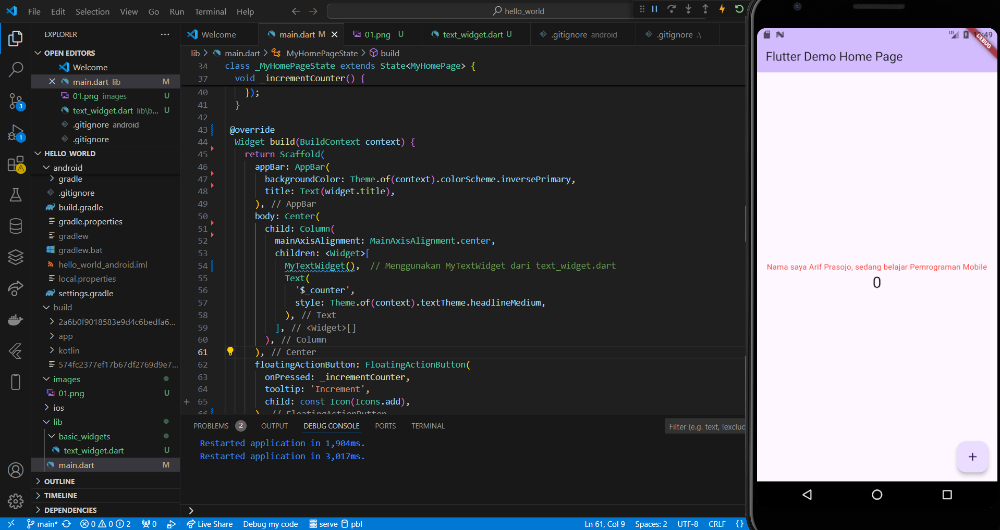

# Praktikum Flutter Pertemuan 6

## Identitas
- **NIM**: 2241760100
- **Nama**: Arif Prasojo.
- **Kelas**: SIB - 3E

## Deskripsi Praktikum
Aplikasi Flutter ini adalah hasil dari serangkaian praktikum yang melibatkan beberapa aspek dasar Flutter, termasuk penggunaan widget seperti `FloatingActionButton`, `BottomAppBar`, dan menampilkan gambar dari `assets`dan beberapa kompenen dasar terkait yang dipelajari pada praktikum 1 - 6

## Hasil Akhir 

### 1. **Connecting To Device**

### 2. **Text Widget**

### 3. **Image Widget**

### 4. **Cupertino Button dan Loading Bar**

### 5. **Floating Action Button (FAB)**

### 6. **Scaffold Widget**

### 7. **Dialog Widget**

### 8. **Input dan Selection Widget**

### 9. **Date and Time Pickers**

